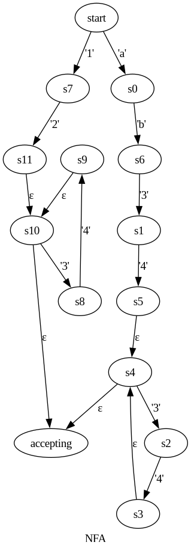
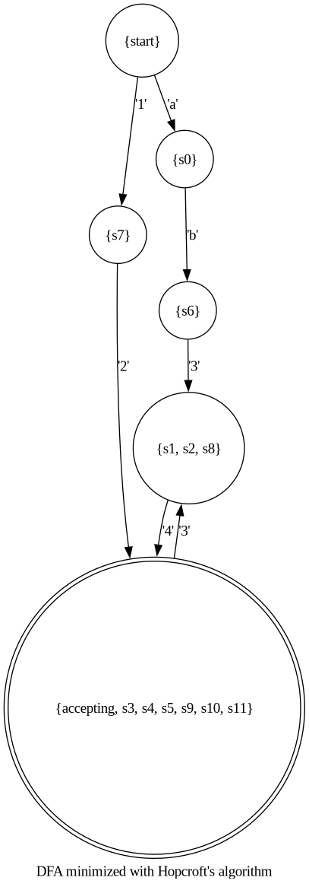

# regex-rs

Regex automata construction, minimization, visualization, and simulation.

## Example: `ab(34)+|12(34)*`

## Dependencies

- Graphviz

## Supported Syntax and Notes

The alphabet consists of all unicode scalar values.

All base regex operations (concatenation, union (`|`), groups (`(...)`), and Kleene star (`*`)) are supported.

Additionally supported:

- Wildcard `.`
- Repetition metacharacters `+`, `?`
- Repetition ranges `{min, max}`, `{n}`, `{n,}`
- Character ranges `[...]`
- Character classes `\w`, `\d`, `\s`
- Scoped backreferences (`\n` where `1 <= n <= u64::MAX`)
